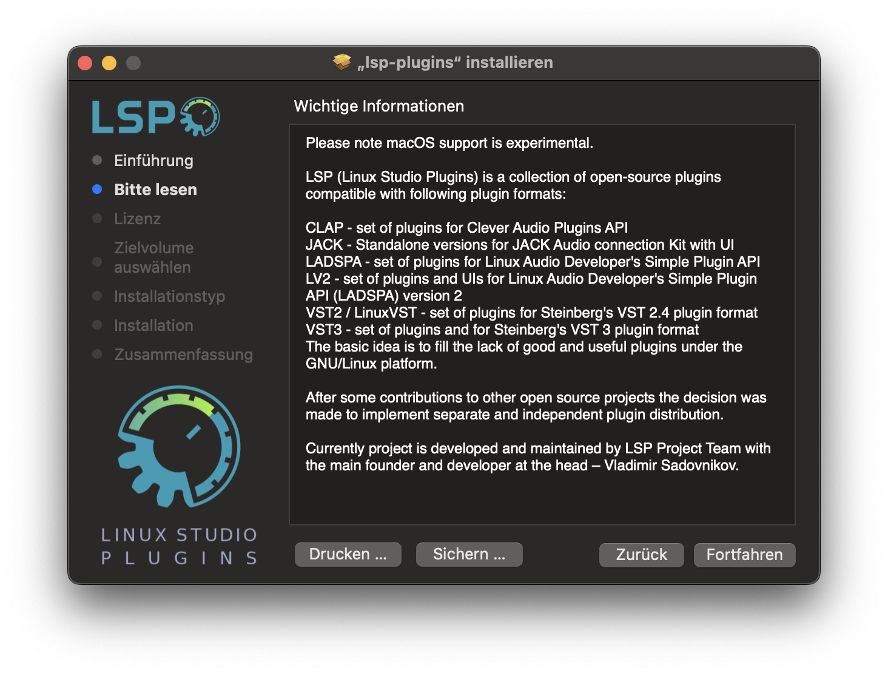
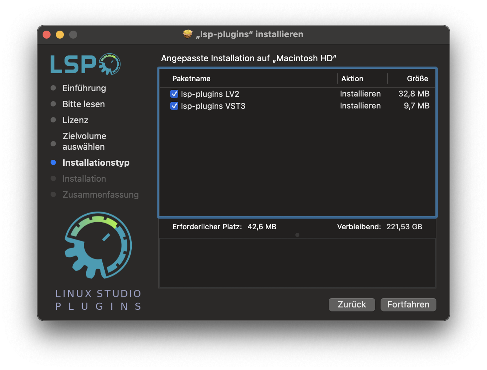

# lsp-macos-pkg

LSP repository to build packages for macOS.

This repository provides the logic to build packages of lsp-plugins
for macOS for Apple Silicon based Macs.

# macOS Installation Notice
The .pkg installer is not signed. The result, macOS will block it from running the first time.

To proceed with the installation:

1. Attempt to Open the .pkg File Once <br>
Double-click the .pkg file. macOS will show a message that the app cannot be opened because it is from an unidentified developer.
Click Cancel to close the message.

2. Go to System Settings<br>
Open System Settings → Privacy & Security.

3. Allow the Blocked Installer<br>
Scroll down to the Security section. You will see a message saying that the installer was blocked.
Click "Allow Anyway".

4. Re-open the Installer<br>
Open the .pkg file again. You will now have the option to proceed by clicking Open and entering your password if prompted.

# Demo Screenshots 





# Usage

The idea is that we can simply create a tag with version of lsp-plugins (tag or branch) and we get the *.pkg from the github pipeline as an artifact.

For manual use:

Note that VERSION can also a tag or branch of lsp-plugins
```
brew install make pkgconf cairo freetype
gmake clean
gmake FEATURES="lv2 ui" VERSION="devel"
```